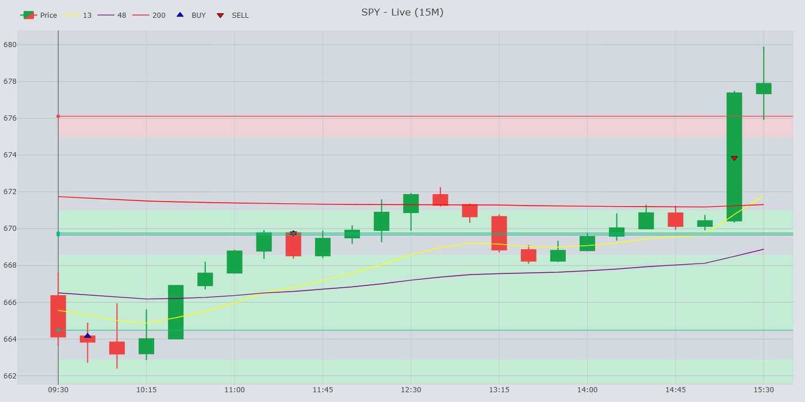

# StratForge ⚡️

**StratForge** is a **single‑asset, multi‑strategy trading engine**. It is designed to run multiple algorithmic strategies side‑by‑side on the same symbol (default: SPY, but you can configure any ticker your data provider/websocket supports). Built for extensibility, StratForge emphasizes modular design, durable storage, and future self‑learning capabilities.

> ⚠️ Educational and personal use only. Not financial advice.

---

## Key Features

* **Multi‑strategy host** — Flag Zone, Momentum, Trend, Mean Reversion, and more.
* **Ticker‑agnostic** — Change `config.json` to trade any symbol supported by your provider.
* **Robust storage** — Append‑only Parquet + DuckDB queries, with daily/monthly compaction.
* **Event‑sourced objects** — Zones, levels, markers, and flags, queryable by time/price windows.
* **Live visuals** — Plotly Dash frontend + FastAPI WebSocket broadcaster.
* **Future‑proofed** — Storage contracts and APIs designed for eventual self‑learning extensions.

---

## Quick Start

```bash
# clone and enter
$ git clone git@github.com:Merced3/Flag-Zone-Bot.git
$ cd Flag-Zone-Bot

# create venv + install deps
$ python -m venv venv
$ source venv/bin/activate
$ pip install -r requirements.txt

# run engine
$ python main.py
```

Configure your ticker and timeframes in [`config.json`](docs/configuration/ticker-and-timeframes.md).

---

## Docs

StratForge is documentation‑first. See the [`docs/`](docs/TOC.md) folder for full details.

* [Overview](docs/overview/stratforge.md)
* [Architecture](docs/architecture/overview.md)
* [Storage System](docs/data/storage-system.md)
* [Strategies](docs/strategies/README.md)
* [Configuration](docs/configuration/ticker-and-timeframes.md)
* [Runbooks](docs/runbooks/)
* [ADRs](docs/adr/)

---

## Example Output

Latest charts are written to `storage/images/` and served live in the Dash UI.



---

## Contributing

StratForge is a personal project, but PRs, discussions, and feedback are welcome. Tests live under `tests/` and run via GitHub Actions.

---

## Disclaimer

This software is for **educational and research purposes only**.
It is **not financial advice**. Use at your own risk.
